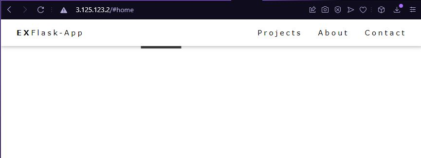

# **Automatyczna instalacja aplikacji i serwera proxy**
## **1.** Instalacja ansible
    yum install ansible 
## **2.** Tworzenie plików konfiguracyjnych potrzebnych do ansible w dowolnym folderze
* ### host.ini
* ### setup.yaml
* ###  img
    * #### db_cred.yaml
* ###  files
    * #### app.service
    * #### lb.conf
## **3.** Specyfikacja hosta
### W pliku host.ini w kwadratowych nawiasach piszemy nazwę hosta na którym chcemy wykonywać komendy, następnie IP hosta i imię użytkownika
    [load_balancer_nodes]
    3.125.123.2 ansible_user=ec2-user

    [app_nodes]
    18.156.162.21 ansible_user=ec2-user
    18.184.176.250 ansible_user=ec2-user
## **4.** Uzupełnianie pliku setup.yaml z którego ansible wykonuje zadania dla serwera proxy
### Wskazujemy na adresy prywatne maszyn które będą serwowały aplikacje, instalujemy konfigurujemy i restartujemy serwer proxy
    ---
    - hosts: load_balancer_nodes
    become: yes
    vars:
    app_ips:
      - 172.31.4.78:8080
      - 172.31.7.209:8080
    tasks:
    - name: install epel
      yum:
        name: https://dl.fedoraproject.org/pub/epel/epel-release-latest-7.noarch.rpm
        state: present
    - name: install nginx
      yum:
        name: nginx
        state: present
    - name: put nginx conf
      template:
        src: files/lb.conf
        dest: /etc/nginx/conf.d/blog.conf
    - name: reload nginx
      systemd:
        name: nginx
        state: reloaded
## **5.** Uzupełnianie pliku setup.yaml z którego ansible wykonuje zadania dla aplikacji 
### Pobieramy aplikacje z repo na Githubie i instalujemy zależności aby mogła działać
    ...
    - hosts: app_nodes
    become: yes
    vars:
        APP_NAME: ExampleApp
        APP_REPO: https://github.com/DziadoszWiktor/flask-example-app
        APP_PORT: 8080
    tasks:
    - name: "install os packages"
      yum:
        name: python3, python3-pip, git
    - name: "sync repo"
      git:
        repo: "{{ APP_REPO }}"
        dest: "/opt/{{APP_NAME}}"
        force: yes
    - name: "app user"
      user:
        name: "{{ APP_NAME }}"
    - name: "change permissions"
      file:
        owner: "{{APP_NAME}}"
        group: "{{APP_NAME}}"
        path: "/opt/{{APP_NAME}}"
        recurse: yes
    - name: "venv for python + requirements"
      pip:
        requirements: "/opt/{{APP_NAME}}/requirements.txt"
        virtualenv: "/opt/{{APP_NAME}}/.venv"
        virtualenv_command: python3 -m venv
      become_user: "{{ APP_NAME }}"
    - name: "register as a service"
      template:
        src: files/app.service
        dest: "/etc/systemd/system/{{APP_NAME}}.service"
    - name: "start service"
      systemd:
        daemon_reload: yes 
        name: "{{ APP_NAME }}"
        state: restarted
## **6.** Folder "files"
### W tym foldzerze potrzebujemy wskazać niektóre niezbędne ustawienia dla naszej konfiguracji
* ### app.service
        [Unit]
        Description=My {{APP_NAME}}
        After=network-online.target

        [Service]
        Type=simple
        User={{APP_NAME}}
        ExecStart=/opt/{{APP_NAME}}/.venv/bin/flask run --host 0.0.0.0 --port 8080
        WorkingDirectory=/opt/ExampleApp
        Restart=always

        [Install]
        WantedBy=multi-user.target
* ### lb.conf
        upstream my_app {
            
                server {{ app_ip }};
            
        }
        server {
        listen 80;
            location / {
                proxy_pass http://my_app;
                proxy_set_header Host $host;
            }   
        }
## **7.** Instalacja wszystkich zależności i wyświetlenie aplikacji
### Po poprawnym ustawieniu wszystich parametrów możemy użyć komendy:
        ansible-playbook -i hosts.ini setup.yaml
### Jak nie pojawiły się błędy to wpisując adres IP serwera proxy zostaniemy przekierowani do maszyn które serwują aplikację, w tym wypadku są to dwie maszyny gdyby było za dużo obciążenia na jednej druga służy nam pomocą, aby to przetestować możemy wyłączyć jedną z maszyn, zauważymy że aplikacja nadal będzie dostępna.
